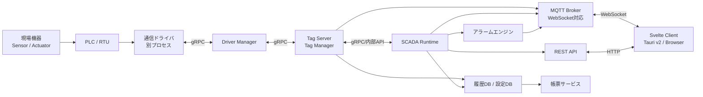
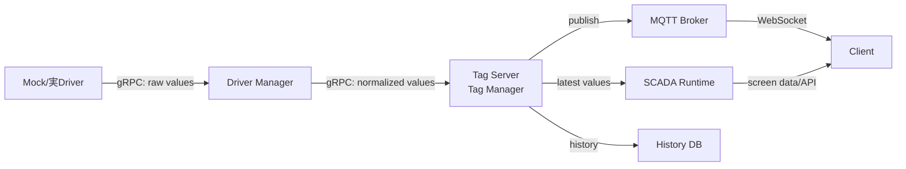
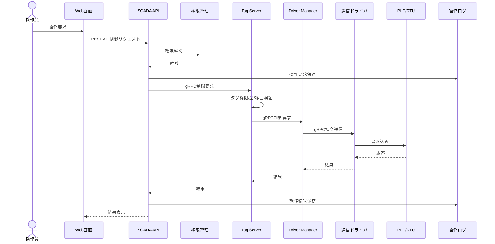
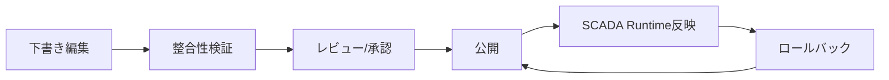

# SCADAアプリ 基本設計書

## 1. 目的

本書は、SCADAアプリケーションを構成する主要要素を洗い出し、初期開発で共有すべき基本設計を定義する。

SCADAは設備・装置の状態を監視し、必要に応じて制御指令を行い、運転履歴・アラーム・帳票を通じて現場運用を支援するシステムである。本設計では、Webベースの監視画面、リアルタイムデータ収集、アラーム管理、履歴保存、ユーザー権限管理を中心に扱う。

## 2. 想定スコープ

### 2.1 対象

- 設備・装置のリアルタイム監視
- PLC、RTU、ゲートウェイ等からのデータ収集
- 操作員による制御指令
- アラーム検知、通知、確認、履歴管理
- トレンド表示、イベント履歴、帳票出力
- ユーザー認証、権限管理、操作ログ
- システム状態監視、通信状態監視

### 2.2 対象外

- PLCラダー、ファームウェア、制御ロジック本体の実装
- 現場ネットワーク機器の物理設計
- 安全計装システムの代替
- 法規制・認証が必要な安全停止機能の直接制御

## 3. SCADAを構成する要素

## 3.1 現場機器層

現場の測定・制御対象となる機器群。

- センサー: 温度、圧力、流量、レベル、電流、電圧、振動など
- アクチュエータ: バルブ、ポンプ、モーター、ブレーカー、インバータなど
- PLC/RTU: 入出力信号の収集、ローカル制御、通信中継
- ゲートウェイ: プロトコル変換、エッジ集約、一次バッファリング

## 3.2 通信層

現場機器とSCADAサーバー間のデータ通信を担う。

- 通信プロトコル: Modbus TCP/RTU、OPC UA、EtherNet/IP、MQTT、BACnet等
- 通信管理: 接続監視、再接続、タイムアウト、リトライ
- データ品質: 正常、通信断、範囲外、手動入力、シミュレーションなどの品質フラグ
- セキュリティ: TLS、証明書、ネットワーク分離、許可リスト

## 3.3 データ収集・タグ管理層

SCADA内部で扱う監視点をタグとして定義し、収集値を標準化する。

- タグ定義: タグID、名称、データ型、単位、スケール、上下限、収集周期
- タグ分類: アナログ入力、デジタル入力、アナログ出力、デジタル出力、内部演算タグ
- 値変換: スケーリング、単位変換、丸め、欠損値処理
- 演算タグ: 合計、平均、差分、稼働率、状態判定
- キャッシュ: 最新値、直近品質、最終更新時刻

## 3.4 監視画面層

操作員が設備状態を把握するための画面群。

- 監視ダッシュボード: 重要KPI、設備状態、通信状態、アラーム件数
- 系統図・プロセス図: 設備配置、配管、電気系統、状態色
- 詳細画面: 個別設備の測定値、状態、操作、履歴
- トレンド画面: リアルタイムトレンド、履歴トレンド、複数タグ比較
- アラーム画面: 発生中、未確認、確認済み、復旧済み
- イベント履歴画面: 操作、状態変化、通信異常、システムイベント

## 3.5 制御操作層

操作員から現場機器へ制御指令を送る。

- 操作種別: 起動、停止、開、閉、設定値変更、モード切替
- 操作確認: 誤操作防止の確認ダイアログ、二段階操作
- 権限確認: 操作前のロール確認、重要操作の再認証
- インターロック表示: 操作不可理由、条件未成立理由
- 指令結果: 送信成功、送信失敗、現場応答、タイムアウト
- 操作ログ: 操作員、対象タグ、操作前値、操作後値、時刻、結果

## 3.6 アラーム管理層

異常状態を検知し、操作員へ通知する。

- アラーム条件: HH、H、L、LL、偏差、変化率、通信断、状態不一致
- 重要度: Critical、High、Medium、Low、Info
- 状態管理: 発生、確認、復旧、抑制、保留
- 通知: 画面表示、音、メール、チャット、外部通知連携
- 抑制・棚上げ: メンテナンス時の一時抑制、条件付き抑制
- 履歴: 発生時刻、確認時刻、復旧時刻、確認者、メッセージ

## 3.7 履歴・帳票層

運転データとイベントを保存し、分析・報告に利用する。

- 時系列データ: タグ値、品質、取得時刻
- イベント履歴: 状態変化、操作、通信異常、ログイン
- アラーム履歴: 発生、確認、復旧、抑制
- 帳票: 日報、月報、アラーム集計、稼働率、設備別統計
- エクスポート: CSV、Excel、PDF
- 保存期間: 最新値、短期履歴、長期アーカイブを分離

## 3.8 ユーザー・権限管理層

利用者を識別し、操作範囲を制御する。

- 認証: ID/パスワード、SSO、MFA
- ロール: 管理者、保全員、操作員、閲覧者
- 権限: 画面閲覧、操作実行、アラーム確認、設定変更、ユーザー管理
- 監査: ログイン履歴、設定変更履歴、操作履歴
- セッション管理: タイムアウト、強制ログアウト、同時ログイン制御

## 3.9 システム管理層

SCADAアプリ自体の安定運用を支える。

- ヘルスチェック: API、DB、通信ドライバ、ジョブ、キュー
- 冗長化: アプリケーション、DB、通信ゲートウェイの冗長構成
- バックアップ: 設定、履歴DB、ユーザー情報
- リストア: 障害復旧手順、復旧確認
- 設定管理: タグ、画面、アラーム、帳票、通信設定
- バージョン管理: 設定変更の差分、承認、ロールバック

## 3.10 エンジニアリング・管理ツール層

SCADAシステムを作成・保守するための設定編集環境。監視ランタイムとは責務を分離し、設計データを編集、検証、公開する。

- 画面エディタ: 監視画面、系統図、詳細画面、ダッシュボードの作成
- 画面管理: 画面一覧、階層、公開状態、権限、版管理
- 画面用オブジェクトエディタ: メーター、ランプ、ボタン、バルブ、ポンプ、配管、トレンド等の部品作成
- オブジェクトライブラリ管理: 部品テンプレート、再利用、カテゴリ、バージョン
- 通信タグエディタ: タグ、アドレス、スケール、収集周期、品質、履歴化設定の編集
- 通信タグ管理: インポート、エクスポート、一括編集、差分確認、未使用タグ検出
- アラーム設定ツール: 閾値、重要度、メッセージ、通知、抑制条件、確認権限の編集
- ドライバ設定ツール: ドライバマニフェスト、接続先、通信周期、接続テストの管理
- プロジェクト管理: 設定一式の保存、検証、公開、ロールバック、バックアップ
- シミュレーション: 模擬タグ値、画面プレビュー、アラーム発生テスト

## 4. 全体アーキテクチャ

本システムはサーバ・クライアント構成とする。クライアントは現場通信ドライバへ直接接続せず、SCADAサーバーが提供するMQTT over WebSocketおよびREST APIを通して監視・操作を行う。

- クライアント: Tauri v2デスクトップアプリ、ブラウザアプリ
- フロントエンド: Svelte
- サーバー: SCADA Runtime、Tag Server/Tag Manager、Driver Manager、REST API、MQTT Broker/WebSocket Gateway
- ドライバ: 別プロセスとして起動される通信ドライバ
- サーバー内部通信: gRPC
- クライアント向け通信: MQTT over WebSocket、REST API



## 4.1 サーバ・クライアント責務

| 区分 | 責務 |
| --- | --- |
| Tauri v2クライアント | デスクトップUI、ローカル通知、ユーザー操作、サーバーAPI接続 |
| ブラウザクライアント | Web UI、ユーザー操作、サーバーAPI接続 |
| SCADA Runtime | 画面定義解釈、画面表示API、アラーム・履歴・操作系との連携 |
| Tag Server/Tag Manager | タグ定義管理、最新値キャッシュ、品質管理、履歴保存、タグ配信 |
| Driver Manager | ドライバプロセス起動、停止、監視、マニフェスト読込、gRPC接続管理 |
| 通信ドライバ | Modbus、OPC UA等のプロトコル実装、現場機器との読み書き |
| MQTT Broker/WebSocket Gateway | 最新値、アラーム、イベント、ドライバ状態のリアルタイム配信 |
| REST API | 設定、履歴検索、帳票、ユーザー管理、書き込み操作、制御要求 |

## 4.1.1 コンポーネント責務詳細

主要コンポーネントの所有データと責務を以下に定義する。特にタグ値、品質、アラーム状態、MQTT配信は重複実装を避ける。

| 項目 | 所有コンポーネント | 方針 |
| --- | --- | --- |
| タグ定義の正本 | SurrealDB上の公開済み定義 | `ProjectVersion` に紐づくスナップショットを正本とする |
| 最新値 | Tag Server | 値、品質、最終更新時刻、sequenceを一元管理する |
| 品質判定 | Tag Server | 通信断、stale、範囲外、手動、模擬値を判定する |
| タグ値MQTT配信 | Tag Server | 最新値と品質の変更をpublishする |
| 画面定義解釈 | SCADA Runtime | 画面定義JSONを読み、SVGオブジェクトへ値を反映する |
| アラーム判定 | Alarm Engine | Tag Serverの値更新を購読し、アラーム状態を管理する |
| アラームMQTT配信 | Alarm Engine | 発生、確認、復旧、抑制状態をpublishする |
| 履歴保存 | Tag Server、Alarm Engine、履歴保存アダプタ | 長期保存は専用ストレージへ委譲する |
| 長期履歴書き込み | History Adapter | Tag ServerやAlarm Engineから受けた履歴データを長期履歴ストレージへ保存する |
| 書き込み検証 | Tag Server | タグ権限、型、範囲、書き込み可否を確認する |
| ドライバ実行管理 | Driver Manager | 起動、停止、監視、再起動、ログ収集を担当する |
| ドライバ通信 | 通信ドライバ | 現場機器との読み書きを担当する |

## 4.1.2 ビルダー同梱ランタイム

開発・設定作成時のビルダーは、ローカル確認用のSCADA Runtime、Tag Server/Tag Manager、Driver Manager、Mock通信ドライバ、MQTT Broker/WebSocket Gatewayを同梱できる構成とする。

これにより、画面、オブジェクト、タグ、アラームを編集しながら、実行時と同じREST APIおよびMQTT over WebSocket経由で動作確認できる。ビルダー専用の別経路でプレビューを実装すると、実際のランタイムとの差異が発生しやすいため、プレビューも可能な限り本番ランタイムと同じ通信経路を使う。

| モード | 用途 | 構成 |
| --- | --- | --- |
| Builder Local Preview | 設計中の即時確認 | Tauri v2 + Svelte + 同梱Runtime + Tag Server + Driver Manager + Mock Driver |
| Server Runtime | 本番・検証運用 | SCADA Runtime + Tag Server + Driver Manager + 実Driver |
| Browser Client | 運用監視 | Svelte Web Client + サーバーAPI接続 |

## 4.1.3 ビルダーの別プロセス構成

ビルダーは、Tauri v2本体にすべての編集機能を組み込まず、編集機能を支えるサービスを別プロセスとして構成する方針を推奨する。

Tauri v2はデスクトップシェル、ウィンドウ管理、ローカルプロセス起動、ファイルアクセス、通知、OS連携を担当する。タグエディタ、画面エディタ、アラーム設定、プロジェクト管理などのUIはSvelteで実装し、保存・検証・プレビュー反映などの処理はBuilder APIへ委譲する。

| プロセス | 主な責務 |
| --- | --- |
| Tauri Shell | デスクトップ起動、ウィンドウ管理、ローカルサービス起動、OS連携 |
| Svelte Builder UI | タグエディタ、画面エディタ、オブジェクトエディタ、アラーム設定画面 |
| Builder API | 設計データ保存、入力検証、差分計算、公開前検証、プロジェクト管理 |
| Preview Runtime | 下書き設定を読み込むローカル確認用ランタイム |
| Tag Server/Tag Manager | タグ定義管理、最新値キャッシュ、品質管理、MQTT配信 |
| Driver Manager | Mock/実ドライバの起動、停止、ヘルスチェック |
| Mock Driver | 開発・確認用のタグ値生成、書き込み応答、通信異常再現 |

### 分離方針

- 画面描画やエディタ操作の大半はSvelte/TypeScript側で高速に開発する。
- 設定保存、検証、差分、公開処理はBuilder APIに集約する。
- ランタイム挙動の確認はPreview Runtimeを通し、本番Runtimeと同じREST APIおよびMQTT over WebSocketを使う。
- Tauri側Rustは厚くし過ぎず、ローカルサービスの起動、停止、監視、ファイル選択、OS連携に限定する。
- Rustで実装するサービスはcrateを分割し、変更頻度が高いUI編集ロジックとビルド境界を分ける。

### 注意点

別プロセス化は開発しやすさと責務分離に有効だが、初期から細かく分け過ぎるとプロセス管理、ポート管理、ログ収集、障害調査が難しくなる。初期はTauri Shell、Builder API、Preview Runtime、Tag Server、Driver Manager、Mock Driver程度の粒度に留める。

## 4.1.4 ローカル同梱サービス運用

Tauri Builderに同梱するローカルサービスは、開発体験と安全性のためにTauri Shellが一元管理する。

| 項目 | 方針 |
| --- | --- |
| 起動順序 | SurrealDB、Builder API、Tag Server、Driver Manager、Preview Runtime、MQTT Brokerの順に起動する |
| 終了処理 | Tauri Shell終了時に子プロセスを確実に停止する |
| ポート | 固定値に依存せず、衝突時は再割当可能にする |
| bind先 | ローカルプレビュー用サービスは原則 `127.0.0.1` に限定する |
| 認証 | 起動時に生成するローカルトークンをサービス間で共有する |
| ヘルスチェック | REST `/health` またはgRPC health checkを必須とする |
| ログ | サービス別ログを出力し、ローテーションする |
| 障害表示 | Builder UIで各サービスの起動状態、異常、再起動状況を表示する |
| クラッシュ対応 | Driver Manager、Mock Driver、Preview Runtimeは再起動方針を定義する |

## 4.1.5 本番サービス・デーモン運用

本番・検証環境では、UIやBuilderの起動状態に依存せず監視、収集、アラーム判定、履歴保存を継続する必要がある。そのため、主要なサーバー側コンポーネントはOSサービス、デーモン、またはコンテナサービスとして常駐させる。

### 常駐対象

| コンポーネント | 本番運用形態 | 理由 |
| --- | --- | --- |
| SCADA Runtime | OSサービス、デーモン、コンテナ | クライアント向けAPIと画面ランタイムを提供する |
| Tag Server/Tag Manager | OSサービス、デーモン、コンテナ | タグ定義、最新値、品質、短期キャッシュを継続管理する |
| Driver Manager | OSサービス、デーモン、コンテナ | ドライバの起動、監視、再起動を継続する |
| Alarm Engine | OSサービス、デーモン、コンテナ | 画面を閉じていてもアラーム判定を継続する |
| MQTT Broker/WebSocket Gateway | OSサービス、デーモン、コンテナ | クライアントへのリアルタイム配信を継続する |
| History Adapter | OSサービス、デーモン、コンテナ | 長期履歴ストレージへの保存を継続する |

### ドライバの運用方針

通信ドライバは、原則として個別のOSサービスにはせず、Driver Manager配下の子プロセスとして起動、停止、監視する。これにより、マニフェスト駆動の追加、異常時再起動、バージョン互換性確認、ドライバ別ログ収集をDriver Managerに集約する。

```text
scada-driver-manager
  - modbus-driver
  - opcua-driver
  - mock-driver
```

### 実行形態の切替

同じ実行バイナリを、開発時はTauri Shell配下の子プロセスとして、本番時はOSサービス、デーモン、またはコンテナサービスとして起動できる設計にする。

| モード | 起動主体 | 用途 |
| --- | --- | --- |
| Local Preview | Tauri Shell | ビルダー上での即時動作確認 |
| Standalone Service | systemd、launchd、Windows Service等 | オンプレミス本番、検証環境 |
| Container Service | Docker、Docker Compose、Kubernetes | サーバー運用、冗長化、クラウド連携 |

### 注意点

- サービス化するコンポーネントはヘルスチェック、ログ、設定ファイル、終了シグナル処理を持つ。
- 本番サービスはUI終了に影響されず動作し続ける。
- Tauri Builderは本番サービスを直接所有せず、REST API等を通して状態確認と設定公開を行う。
- 本番環境ではサービスの起動順、依存関係、再起動ポリシーを明確にする。

## 4.2 通信方式の使い分け

| 用途 | 通信方式 | 方針 |
| --- | --- | --- |
| ドライバ値収集 | gRPC | Driver Managerがドライバから値を受け、Tag Serverへ渡す |
| タグ最新値管理 | 内部API/gRPC | Tag Serverが最新値、品質、時刻を一元管理する |
| タグ最新値配信 | MQTT over WebSocket | クライアントが購読し、リアルタイムに画面更新する |
| アラーム・イベント配信 | MQTT over WebSocket | 発生、確認、復旧、通信状態変化を配信する |
| 履歴検索 | REST API | 期間指定、集計、ページングを伴うためHTTPで取得する |
| 設定変更 | REST API | 監査ログ、バリデーション、権限確認を同期的に行う |
| リアルタイム性が低い書き込み | REST API | 操作結果を明示的に返し、監査証跡を残す |
| 即時性が必要な制御指令 | REST API | クライアントからAPIで受け、サーバー内部でTag Server、Driver Managerへ中継する |
| サーバー内部制御 | gRPC | Runtime、Tag Server、Driver Manager、各ドライバ間の型付き通信に利用する |

## 4.2.1 タグ値データフロー

タグ値は、通信ドライバからランタイムへ直接渡さず、Driver ManagerとTag Server/Tag Managerを経由して扱う。



### 方針

- Mockドライバも本番ドライバと同じ経路で接続する。
- Tag Serverはタグ定義、最新値、品質、最終更新時刻、履歴化対象を管理する。
- Tag Serverは最新値と短期キャッシュをSurrealDBに保持し、長期保存対象を履歴保存アダプタへ渡す。
- SCADA RuntimeはTag Serverからタグ値を取得し、画面、アラーム、操作結果表示に利用する。
- 書き込み要求はRuntimeからTag Serverへ渡し、Tag Serverがタグ権限、型、範囲を検証してDriver Managerへ中継する。
- Runtime直結のMock経路は初期実装を速くする一方、本番経路との差異を生みやすいため原則採用しない。

## 4.2.2 画面初期同期と再接続

画面ランタイムは、初期表示とMQTT再接続時に値の欠落や逆順反映を避けるため、`REST snapshot + MQTT delta` 方式を採用する。

### 初期表示フロー

1. 画面定義から必要なタグ一覧を抽出する。
2. RuntimeまたはTag ServerのREST APIで対象タグの最新値スナップショットを取得する。
3. MQTT over WebSocketで対象タグの更新を購読する。
4. `sequence` または `server_timestamp` を比較し、古い更新は破棄する。
5. 通信断や再接続時はスナップショットを再取得する。

### 方針

- MQTTは差分更新の経路とし、初期値の正本にはしない。
- 画面単位で購読タグを絞り、非表示画面の購読は停止する。
- 再接続時は必ずスナップショットを取り直す。
- retained messageを使う場合でも、RESTスナップショットとの整合確認を行う。

## 4.2.3 MQTTトピック設計

初期トピックは以下を基準とする。実装時にtopic ACLを適用し、ユーザーが閲覧権限を持つタグ、アラーム、画面に限定して購読できるようにする。

```text
scada/{project_id}/tag/{tag_id}/value
scada/{project_id}/tag/{tag_id}/quality
scada/{project_id}/alarm/{alarm_id}/state
scada/{project_id}/driver/{driver_id}/status
scada/{project_id}/event/system
```

### 方針

- タグ値はTag Serverがpublishする。
- アラーム状態はAlarm Engineがpublishする。
- ドライバ状態はDriver Managerがpublishする。
- QoS、retain、payload形式は用途別に定義する。
- MQTT payloadには `tag_id`、`value`、`quality`、`server_timestamp`、`sequence` を含める。

## 4.2.4 RESTエラー応答とUI表示方針

Runtime APIおよびTag ServerのRESTエラー応答は、クライアントが安定して表示できるよう、JSON構造を統一する。

### エラー応答の基本

- 基本形式は `{"error":"<message>"}` とする。
- 値取り込みは成功したがMQTT publishに失敗したケースでは、`driver-values` で `publish_errors` 配列を返せるようにする。
- 非JSON応答を返す実装や中継経路が残る場合でも、クライアントはフォールバック表示できるようにする。

### Runtime UIの表示優先順位

Runtime UIはAPIエラー本文を次の優先順位で解釈する。

1. `error` フィールド
2. `publish_errors[0]`
3. `<endpoint-label> <status>`（例: `command 502`, `projection 503`）

この優先順位はE2Eで固定化し、回帰時に表示文言の意図しない変化を検出できるようにする。

### conditionバリデーションのエラーコード契約

`modify_rules.condition` の検証エラーは、Runtime UIとBuilder UIの双方で共通解釈できるよう、次の形式で返す。

- `code=<ERROR_CODE> path=<OBJECT_PATH> detail=<DETAIL_MESSAGE>`
- 例: `code=MODIFY_RULE_CONDITION_BETWEEN_REQUIRES_MIN_MAX path=object=pump-001 property=color detail=op 'between' requires min and max`

#### エラーコード一覧

| code | 意味 | 想定原因 |
| --- | --- | --- |
| `MODIFY_RULE_CONDITION_MISSING_SELECTOR` | 条件に `op` / `all` / `any` がない | condition定義の未入力 |
| `MODIFY_RULE_CONDITION_VALUE_REQUIRED` | 単項比較演算で `value` が不足 | `eq/ne/gt/gte/lt/lte` に値未設定 |
| `MODIFY_RULE_CONDITION_BETWEEN_REQUIRES_MIN_MAX` | `between` に `min` または `max` が不足 | 範囲条件の片側未入力 |
| `MODIFY_RULE_CONDITION_BETWEEN_RANGE_INVALID` | `between` の `min > max` | 範囲条件の設定逆転 |
| `MODIFY_RULE_CONDITION_IN_REQUIRES_VALUES` | `in` の `values` が空または未設定 | 候補値リスト未設定 |
| `MODIFY_RULE_CONDITION_UNSUPPORTED_OP` | 未対応の `op` が指定された | タイポ、未実装演算子 |

#### 表示マッピング（Runtime UI / Builder UI 共通方針）

| code | ユーザー向け表示（例） |
| --- | --- |
| `MODIFY_RULE_CONDITION_MISSING_SELECTOR` | `invalid modify rule condition at <path>: choose op, all, or any` |
| `MODIFY_RULE_CONDITION_VALUE_REQUIRED` | `invalid modify rule condition at <path>: missing value` |
| `MODIFY_RULE_CONDITION_BETWEEN_REQUIRES_MIN_MAX` | `invalid modify rule condition at <path>: between requires min and max` |
| `MODIFY_RULE_CONDITION_BETWEEN_RANGE_INVALID` | `invalid modify rule condition at <path>: min must be less than or equal to max` |
| `MODIFY_RULE_CONDITION_IN_REQUIRES_VALUES` | `invalid modify rule condition at <path>: in requires non-empty values` |
| `MODIFY_RULE_CONDITION_UNSUPPORTED_OP` | `invalid modify rule condition at <path>: unsupported operator` |

- 未知の `code` は生メッセージへフォールバックし、UI実装の先行配布時でも最低限の原因把握を可能にする。
- Builder UIは編集フォーム上の該当ruleへフォーカスできるよう、`path` の機械解釈（`object=<id> property=<name>`）を維持する。

#### Builder API 構造化マッピング出力仕様

Builder UI着手前の共通インターフェースとして、Builder APIは `code/path/detail` をユーザー向け表示へ変換したJSONを返せるものとする。

- 入力: `code=<...> path=<...> detail=<...>` 形式の生エラー文字列
- 出力: `code`, `path`, `detail`, `user_message`, `known_code` を持つJSON
- 未知コードの場合は `known_code=false` とし、`user_message` に生メッセージをそのまま入れる

| フィールド | 型 | 説明 |
| --- | --- | --- |
| `code` | string \\| null | 解析できたエラーコード |
| `path` | string \\| null | 該当ruleの位置情報（例: `object=pump-001 property=color`） |
| `detail` | string \\| null | 実装側の詳細理由 |
| `user_message` | string | UI表示向けメッセージ |
| `known_code` | boolean | 既知コードとして変換できたか |

```json
{
    "code": "MODIFY_RULE_CONDITION_BETWEEN_REQUIRES_MIN_MAX",
    "path": "object=pump-001 property=color",
    "detail": "op 'between' requires min and max",
    "user_message": "invalid modify rule condition at object=pump-001 property=color: between requires min and max",
    "known_code": true
}
```

Builder UIは `known_code=true` のとき定型ガイドを表示し、`known_code=false` のときは `user_message` をそのまま表示する。

初期実装では、`apps/builder-ui` にこの契約を確認するための最小画面を置く。Builder UI は Vite dev server の `/api` proxy を通して Builder API `127.0.0.1:18110` へ接続し、少なくとも次の表示を持つ。

- 生エラー文字列の入力欄
- `POST /api/v1/errors/map` 実行ボタン
- `user_message`
- `known_code`
- `path`
- `path` の解析結果に応じた該当編集入力へのフォーカス

この最小画面は、Builder本体のタグ/画面エディタ着手前に、エラー契約と表示フォールバックを固定するための検証面とする。

初期段階では `mock-main.screen.json` 相当の最小 Screen Object Editor を置き、`path` から抽出した `object` / `property` を対応する object フォームと modify rule フォームへ反映する。より具体的な `property` がある場合は rule property 入力を優先してフォーカスし、object が未登録なら草稿 object をその場で追加して編集先を失わないようにする。

この最小 Editor では、rule の condition 本体入力として `op/value/min/max/values` を持ち、`between` や `in` など演算子ごとに必要項目を切り替えて編集できるものとする。

また、Editor 上の入力値は `screen-definition.schema.json` に沿う最小シリアライズへ変換し、保存前にJSONプレビューとして確認できるようにする。

最小I/O段階では、Builder UI は生成した `screen-definition` JSON のファイル読込（Load）とファイル保存（Download）を提供する。続く段階で Builder API の `GET/PUT /api/v1/screens/{screen_id}` を使った project `config/screens` への読込・保存導線を追加し、UI上の編集結果を同一契約で往復できるようにする。

#### Builder API エラーマッピングHTTPエンドポイント

Builder UI から直接利用できる最小連携点として、Builder API は次のHTTPエンドポイントを提供する。

- `POST /api/v1/errors/map`
- `GET /api/v1/screens/{screen_id}`
- `PUT /api/v1/screens/{screen_id}`
- request body: `{"error":"code=... path=... detail=..."}`
- response body: エラーマッピングは構造化マッピング出力仕様と同じ JSON、screen入出力は `screen-definition` JSON と `{"saved_path":"..."}`
- 不正JSONは `400` で `{"error":"invalid error map JSON: ..."}` を返す

このエンドポイントは Builder UI 実装初期のエラー表示統一に使い、将来UI内へ同等ロジックを内包しても契約は維持する。

ローカル同梱サービスでは、Builder API を `--serve --addr 127.0.0.1:18110` で常駐起動し、Builder UI から直接このエンドポイントを利用できるようにする。

Builder API のHTTP契約は [contracts/openapi/builder.yaml](contracts/openapi/builder.yaml) を正本とし、`/health`、`POST /api/v1/errors/map`、`GET/PUT /api/v1/screens/{screen_id}` の request/response はこの OpenAPI に従って管理する。

Builder UI 側では `apps/builder-ui/src/contracts/builderApi.ts` を契約型の取り込み窓口とし、request/response の shape guard により `POST /api/v1/errors/map` の入出力を実行時にも検証する。

実装側では、少なくとも `/health`、`POST /api/v1/errors/map`、`GET/PUT /api/v1/screens/{screen_id}` のステータスコード、`application/json`、必須フィールド形を境界テストで固定し、OpenAPI と実装のドリフトを早期に検出する。

### OpenAPI共通コンポーネント運用ルール

- `contracts/openapi/runtime.yaml` の `paths` では、成功応答、失敗応答ともに `components.responses` の `$ref` を優先して使用する。
- レスポンス本文の型は `components.schemas` に定義し、同一意味のschemaを重複定義しない。
- 新規API追加時は、既存の `ErrorResponse` / 共通responseで表現できるかを先に確認し、必要な場合のみ新規コンポーネントを追加する。
- レビュー時は「paths直書きの重複responseが増えていないこと」「UI表示優先順位と矛盾するerror payloadを導入していないこと」を確認項目に含める。

## 4.3 ドライバマネージャーとマニフェスト駆動

通信ドライバはSCADA本体から分離した別プロセスとして実装する。Driver Managerはドライバマニフェストを読み込み、対応プロトコル、実行ファイル、設定スキーマ、権限、ヘルスチェック方法をもとにドライバを管理する。

### マニフェスト項目

| 項目 | 説明 |
| --- | --- |
| driver_id | ドライバを一意に識別するID |
| name | 表示名 |
| version | ドライババージョン |
| executable | 起動対象の実行ファイル |
| supported_protocols | Modbus TCP、OPC UA等の対応プロトコル |
| grpc_service | ドライバが提供するgRPCサービス定義 |
| config_schema | 接続設定、タグアドレス設定などのスキーマ |
| permissions | 必要なネットワーク、ファイル、シリアルポート等の権限 |
| health_check | 起動確認、疎通確認、異常判定方法 |
| capabilities | 読み取り、書き込み、購読、バッチ読込等の対応機能 |

### 管理機能

- ドライバの登録、更新、削除
- ドライバプロセスの起動、停止、再起動
- ヘルスチェックと異常時の再起動
- ドライバログ収集
- ドライバごとの接続設定管理
- 対応タグと機能の検出
- ドライババージョンと互換性確認

## 5. 機能設計

## 5.1 リアルタイム監視

### 概要

現場機器から収集したタグ最新値をSCADAサーバーへ集約し、MQTT over WebSocketでクライアントへ配信する。

### 主な機能

- タグ最新値の取得
- MQTT over WebSocketによるリアルタイム配信
- 通信断・値異常の品質表示
- 監視画面上の色・アイコン・数値更新
- 設備単位、エリア単位、重要度単位のフィルタ

### 入出力

| 区分 | 内容 |
| --- | --- |
| 入力 | タグ値、品質、取得時刻 |
| 出力 | 画面表示値、状態色、アラーム表示 |

## 5.2 制御操作

### 概要

権限を持つユーザーが設備に対して制御指令を送信する。クライアントは通信ドライバへ直接接続せず、REST APIを通してSCADA Runtimeへ操作要求を送る。SCADA Runtimeは操作要求を受け付け、Tag Serverがタグ権限、型、範囲、書き込み可否を検証し、Driver Manager経由で対象ドライバへ指令を中継する。

### 主な機能

- 操作対象の選択
- 操作権限チェック
- 操作前確認
- REST APIによる制御要求受付
- Tag Server、Driver Manager経由の制御指令送信
- 結果表示
- 操作ログ保存

### 制御フロー



### 制御指令状態

制御指令は成功/失敗だけでなく、以下の状態を持つ。画面表示、操作ログ、監査ログでは現在状態と最終結果を区別する。

| 状態 | 説明 |
| --- | --- |
| Requested | クライアントが要求した |
| Accepted | Runtimeが要求を受け付けた |
| Validated | Tag Serverが権限、型、範囲、書き込み可否を検証した |
| Sent | Driver Managerからドライバへ送信した |
| DriverAck | ドライバが受け付けた |
| DeviceAck | PLC/RTUから応答があった |
| Verified | readback等で反映確認済み |
| Timeout | 応答が期限切れ |
| Failed | 送信または実行に失敗した |
| Rejected | 権限、範囲、インターロック等で拒否された |

### 方針

- 制御要求には冪等性キーを付与し、二重送信を検出できるようにする。
- タイムアウト時間はタグまたは操作種別ごとに定義する。
- 必要な操作ではreadbackタグにより反映確認を行う。
- 操作ログには要求値、検証結果、送信結果、現場応答、最終状態を保存する。
- 重要操作では操作理由入力、再認証、二段階確認を要求できるようにする。

## 5.3 アラーム監視

### 概要

タグ値や通信状態を監視し、条件成立時にアラームを発生させる。

### 主な機能

- 閾値監視
- 状態変化監視
- 通信断監視
- アラーム発生・復旧判定
- 確認操作
- 抑制・棚上げ
- アラーム履歴保存

### 状態

| 状態 | 説明 |
| --- | --- |
| Active | 異常条件が成立している |
| Acknowledged | 操作員が確認済み |
| Cleared | 異常条件が解消済み |
| Shelved | 一時的に通知対象外 |
| Suppressed | 条件により抑制中 |

## 5.4 履歴トレンド

### 概要

保存済みの時系列データを検索し、グラフ表示する。

### 主な機能

- タグ選択
- 期間指定
- 粒度指定
- 最大、最小、平均、最終値の集計
- CSV/Excel出力

## 5.5 帳票

### 概要

運転実績やアラーム情報を定型フォーマットで出力する。

### 主な機能

- 日報、月報
- 設備別稼働率
- アラーム集計
- 操作履歴集計
- PDF/Excel出力
- 定期生成

## 5.6 画面ランタイム

### 概要

画面ランタイムは、ビルダーで作成された画面定義を読み込み、ページ単位でキャンバス領域にフロー画面を表示する。画面上の設備・計器・操作部品はSVGオブジェクトとして配置し、タグ値、品質、アラーム状態、操作定義に応じて表示や動作を変化させる。

### 主な機能

- ページ単位の画面表示
- キャンバス座標系によるオブジェクト配置
- SVGオブジェクトの表示、非表示、色変更、点滅、文字列更新
- 画面定義によるSVGオブジェクトとタグのバインディング
- MQTT over WebSocketで受信したタグ値によるリアルタイム更新
- REST APIによる操作要求
- 画面遷移、ポップアップ、設備詳細表示
- 権限に応じた操作可否制御
- 通信断、品質不良、アラーム状態の視覚表現

### SVGバインディング方針

SVGにはタグ情報やモディファイ情報を直接埋め込まない。SVGは表示形状を表す部品として扱い、タグ、品質、アラーム、操作、表示変更ルールは画面定義JSONまたはDB側に保持する。

| 項目 | 方針 |
| --- | --- |
| object_id | 画面定義上のオブジェクトIDでSVG部品を識別する |
| svg_asset_id | 使用するSVG部品を参照する |
| tag_bindings | 画面定義側でvalue、state、alarm、quality、command等を指定する |
| modify_rules | 画面定義側で色、文字、表示/非表示、点滅等を指定する |
| action_id | 画面定義側で操作時に呼び出すREST APIアクションを参照する |

### 注意点

- SVGは表示部品として扱い、タグバインディングや制御操作の定義は持たせない。
- 外部から取り込んだSVGはスクリプト、外部参照、イベント属性を除去してから保存する。
- SVGを直接DOMに挿入する場合はXSS対策を必須とする。
- HTML Canvasへすべて描画すると個別オブジェクトのイベント処理や状態更新が複雑になるため、初期はSVG DOMを基本とする。
- 大量オブジェクト画面では更新対象を差分に限定し、全SVGの再描画を避ける。

## 5.7 アラーム・トレンド・ガントチャート表示

### 概要

アラーム、トレンド、ガントチャート等は、画面ランタイムのフロー画面とは別に、DBおよびRuntime APIから取得したデータを表示する標準画面として実装する。

### 主な機能

| 機能 | データ取得 | 表示内容 |
| --- | --- | --- |
| アラーム | REST API、MQTT over WebSocket | 発生中、未確認、確認済み、復旧済み |
| 履歴トレンド | REST API | 時系列データ、集計値、複数タグ比較 |
| リアルタイムトレンド | MQTT over WebSocket、REST API | 最新値の連続表示、短期バッファ |
| ガントチャート | REST API | 設備稼働状態、工程、停止時間、イベント期間 |
| イベント履歴 | REST API | 操作、状態変化、通信異常、システムイベント |

### 方針

- フロー画面はSVGバインディングによるリアルタイム表示を中心とする。
- アラーム、履歴トレンド、ガントチャートはDB検索が中心となるためREST APIを基本とする。
- リアルタイム性が必要な通知や最新値更新のみMQTT over WebSocketを併用する。

## 5.8 画面エディタ・画面管理

### 概要

監視画面を作成・編集・管理するためのエンジニアリング機能。作成した画面定義はSCADA Runtimeへ公開され、Tauri v2クライアントおよびブラウザクライアントで表示される。

### 主な機能

- 画面新規作成、複製、削除
- 画面サイズ、背景、グリッド、スナップ設定
- オブジェクト配置、移動、整列、前面/背面、グループ化
- タグ値、アラーム状態、通信状態とのデータバインディング
- 条件付き表示、色変更、点滅、表示/非表示
- 画面遷移、ポップアップ、詳細画面呼び出し
- 操作用オブジェクトへのREST API制御要求割り当て
- 編集プレビュー、実行時プレビュー
- 画面公開、非公開、版管理、ロールバック
- 画面ごとの閲覧・操作権限設定

### 画面定義の考え方

画面はSvelteコンポーネントを直接編集するのではなく、JSON等の画面定義データとして管理する。ランタイムは画面定義を読み込み、クライアント上でレンダリングする。

| 項目 | 説明 |
| --- | --- |
| screen_id | 画面ID |
| name | 画面名 |
| layout | 画面サイズ、背景、グリッド設定 |
| objects | 配置オブジェクト一覧 |
| bindings | タグ、アラーム、イベントとの関連付け |
| actions | 操作、画面遷移、REST API呼び出し |
| permissions | 閲覧、操作、編集権限 |
| version | 画面定義バージョン |
| publish_state | 下書き、公開、廃止 |

## 5.9 画面用オブジェクトエディタ・管理

### 概要

画面上で再利用する表示部品・操作部品を作成し、ライブラリとして管理する。

### オブジェクト種別

| 種別 | 例 |
| --- | --- |
| 表示オブジェクト | ラベル、数値表示、単位表示、状態ランプ |
| 計器オブジェクト | メーター、バーグラフ、タンクレベル、トレンド |
| 設備オブジェクト | ポンプ、バルブ、モーター、ブレーカー、配管 |
| 操作オブジェクト | ボタン、スイッチ、設定値入力、モード切替 |
| コンテナ | グループ、パネル、タブ、ポップアップ |
| 複合オブジェクト | ポンプユニット、設備カード、アラーム付き計器 |

### 主な機能

- オブジェクトテンプレート作成、複製、削除
- プロパティ定義: サイズ、色、線、文字、単位、表示桁数
- バインディング定義: 値タグ、状態タグ、アラームタグ、品質タグ
- 状態表現定義: 正常、異常、停止、運転、通信断、手動
- 操作定義: REST API呼び出し、確認ダイアログ、入力制約
- パラメータ化: 同じ部品をタグ差し替えで再利用
- ライブラリ分類: 電気、流体、空調、製造ライン、汎用UI
- バージョン管理: 使用中オブジェクトへの影響確認

### オブジェクト定義の考え方

オブジェクトは表示形状、プロパティ、バインディング、操作、状態表現を持つテンプレートとして定義する。画面上に配置されたオブジェクトはテンプレート参照とインスタンス設定を持つ。

## 5.10 通信タグエディタ・通信タグ管理

### 概要

通信タグを作成・編集し、ドライバ、通信先、アドレス、スケール、履歴化、アラーム条件と関連付ける。

### 主な機能

- タグ新規作成、複製、削除
- CSV/Excelインポート、エクスポート
- タグ一括編集
- ドライバマニフェストに基づく設定項目表示
- 通信先、アドレス、データ型、収集周期の設定
- スケーリング、単位変換、上下限、丸め設定
- 書き込み可否、書き込み範囲、操作権限の設定
- 履歴保存有無、保存周期、集計方式の設定
- アラーム設定との関連付け
- 未使用タグ、重複アドレス、不正アドレスの検出
- 通信テスト、単点読込、単点書込テスト

### タグ検証

| 検証項目 | 内容 |
| --- | --- |
| 一意性 | tag_id、表示名、通信アドレスの重複確認 |
| 型整合性 | ドライバのデータ型とタグデータ型の整合確認 |
| 範囲 | スケール、工業値、書き込み範囲の妥当性確認 |
| 参照 | 画面、アラーム、帳票からの参照整合性確認 |
| 通信 | 接続先、アドレス、読込可否の確認 |

## 5.11 アラーム設定ツール

### 概要

タグ値や状態変化に基づくアラームルールを作成・管理する。

### 主な機能

- アラームルール新規作成、複製、削除
- 対象タグ、条件、閾値、ヒステリシス、遅延時間の設定
- 重要度、色、音、表示メッセージの設定
- 確認要否、確認可能ロール、再通知条件の設定
- 抑制条件、棚上げ上限、メンテナンスモード連動
- 通知先、通知方法、通知時間帯の設定
- アラームグループ、設備、エリア単位の分類
- アラーム発生テスト、復旧テスト
- アラーム定義の一括インポート、エクスポート

### アラーム定義項目

| 項目 | 説明 |
| --- | --- |
| alarm_rule_id | アラームルールID |
| target_tag_id | 対象タグ |
| condition_type | HH、H、L、LL、偏差、通信断、状態不一致等 |
| threshold | 閾値 |
| hysteresis | 復旧判定の揺れ防止幅 |
| delay_ms | 発生遅延 |
| severity | 重要度 |
| message_template | 表示メッセージ |
| ack_required | 確認要否 |
| notification_policy | 通知方針 |
| suppression_rule | 抑制条件 |

## 5.12 プロジェクト管理・公開

### 概要

画面、オブジェクト、タグ、アラーム、帳票、通信設定をSCADAプロジェクトとして管理し、検証済みの定義だけをランタイムへ公開する。

### 主な機能

- プロジェクト作成、複製、削除
- 下書き編集と公開版の分離
- 設定差分表示
- 設定検証
- 公開前レビュー、承認
- ランタイムへの公開
- 公開履歴、ロールバック
- バックアップ、リストア
- 環境別設定: 開発、検証、本番

### 公開フロー



## 6. データ設計

## 6.1 主要エンティティ

| エンティティ | 概要 |
| --- | --- |
| User | 利用者 |
| Role | 権限ロール |
| Permission | 操作・閲覧権限 |
| Area | 設備エリア |
| Equipment | 設備 |
| Tag | 監視・制御点 |
| TagValue | タグ最新値 |
| TagHistory | タグ履歴値 |
| AlarmRule | アラーム条件 |
| AlarmEvent | アラーム発生履歴 |
| ControlCommand | 制御指令履歴 |
| EventLog | システム・操作イベント |
| CommunicationEndpoint | 通信先設定 |
| ReportDefinition | 帳票定義 |
| Project | SCADAプロジェクト |
| ProjectVersion | プロジェクト公開版 |
| ScreenDefinition | 画面定義 |
| ScreenObjectInstance | 画面上の配置オブジェクト |
| ObjectTemplate | 画面用オブジェクトテンプレート |
| ObjectLibrary | オブジェクトライブラリ |
| DriverManifest | ドライバマニフェスト |
| DriverInstance | ドライバ実行インスタンス |
| PublishHistory | 公開履歴 |

## 6.2 タグ定義項目

| 項目 | 説明 |
| --- | --- |
| tag_id | 一意なタグID |
| name | 表示名 |
| description | 説明 |
| equipment_id | 所属設備 |
| tag_type | AI、DI、AO、DO、CALC等 |
| data_type | boolean、integer、float、string |
| unit | 単位 |
| address | PLC/RTU上のアドレス |
| protocol | 通信プロトコル |
| scan_interval_ms | 収集周期 |
| scale_min / scale_max | スケール範囲 |
| engineering_min / engineering_max | 工業値範囲 |
| writable | 書き込み可否 |
| quality | 品質状態 |

## 6.2.1 タグ値モデル

Tag Server、Runtime、MQTT、gRPC、REST APIで扱うタグ値は同じ概念モデルを使う。

| 項目 | 説明 |
| --- | --- |
| tag_id | タグID |
| value | 現在値 |
| data_type | boolean、integer、float、string等 |
| quality | 品質コード |
| source_timestamp | ドライバまたは現場機器が値を取得した時刻 |
| server_timestamp | Tag Serverが値を受け付けた時刻 |
| sequence | Tag Serverが採番する単調増加番号 |
| scan_interval_ms | 収集周期 |
| stale_after_ms | stale判定時間 |
| driver_id | 値の取得元ドライバ |
| endpoint_id | 通信先ID |
| read_status | 読み取り状態 |
| write_status | 最新書き込み状態 |

### 品質コード

| 品質 | 意味 |
| --- | --- |
| Good | 正常 |
| Uncertain | 値はあるが信頼性に注意が必要 |
| Bad | 使用不可 |
| Stale | 更新期限切れ |
| CommLost | 通信断 |
| OutOfRange | 工業値範囲外 |
| Manual | 手動入力 |
| Simulated | シミュレーション値 |

### 方針

- 保存時刻はUTCを基本とする。
- 画面表示時はユーザーまたは設備ローカルタイムゾーンに変換する。
- `source_timestamp` と `server_timestamp` は分離する。
- 画面ランタイムは `sequence` または `server_timestamp` により古い更新を破棄する。

## 6.3 履歴保存方針

| データ | 保存先 | 保存期間例 |
| --- | --- | --- |
| 最新値 | Tag Serverメモリ、SurrealDB | 常時更新 |
| 短期キャッシュ | SurrealDB | 数時間から数日 |
| 秒単位履歴 | 長期履歴ストレージ | 30日 |
| 分単位集計 | 長期履歴ストレージ | 1年 |
| 日単位集計 | 長期履歴ストレージ | 5年 |
| アラーム履歴 | 長期履歴ストレージまたはRDB | 5年 |
| 操作ログ | RDBまたはログ保管基盤 | 5年 |
| 監査ログ | RDB、ログ保管基盤 | 5年以上 |

## 6.3.1 SurrealDBの利用方針

SurrealDBは、SCADA内部の設定、設計データ、短期状態、短期キャッシュに利用する。長期保存が必要な時系列履歴は、別の履歴ストレージへ保存する。

### 利用対象

- Builderのローカルプロジェクト
- 画面定義、オブジェクト定義、タグ定義、アラーム定義
- Mock Driver設定
- Preview Runtime用の下書き設定
- Tag Serverのタグ定義キャッシュ
- 最新値、品質、最終更新時刻
- 短期キャッシュ、短期プレビュー履歴
- タグ、画面、オブジェクト、アラーム間の参照関係

### 長期保存から外す対象

- 長期時系列履歴
- 長期アラーム履歴
- 長期監査ログ
- 大量イベント履歴
- 法定保存や改ざん検知が必要なログ

### 方針

- SurrealDBは内部DBとして使い、長期履歴ストレージとは保存インターフェースで分離する。
- Tag Serverは最新値と短期キャッシュをSurrealDBに保持し、長期保存対象は履歴保存アダプタへ渡す。
- 長期履歴ストレージはTimescaleDB、InfluxDB、または将来の別DBへ差し替え可能にする。
- 本番監査ログはSurrealDB単独に依存せず、追跡性と保全性を持つ保存先を別途用意する。

### スキーマ・マイグレーション

- 画面定義、タグ定義、アラーム定義、ドライバマニフェストには `schema_version` を持たせる。
- Builder起動時にSurrealDBのスキーマ互換性を確認する。
- 必要に応じてマイグレーションを実行する。
- Project export/import形式を定義し、別環境へ移行できるようにする。
- SurrealDB embedded利用とserver利用で同じRepository層を使う。
- バックアップ、リストア、破損時復旧手順を用意する。

## 6.4 設計データと実行時データ

SCADA作成機能では、編集途中の設計データと、監視ランタイムが参照する公開済みデータを分離する。

| 区分 | 内容 | 方針 |
| --- | --- | --- |
| 設計データ | 画面、オブジェクト、タグ、アラーム、帳票、通信設定の下書き | 編集、検証、差分確認の対象 |
| 公開データ | ランタイムへ反映済みの設定スナップショット | 実行時は原則読み取り専用 |
| 実行時データ | 最新値、履歴、アラームイベント、操作ログ | 監視・操作により更新 |
| 監査データ | 設定変更、公開、操作、ログイン | 改ざん検知と追跡性を重視 |

## 6.5 画面定義データ

| 項目 | 説明 |
| --- | --- |
| screen_id | 画面ID |
| project_id | 所属プロジェクト |
| name | 画面名 |
| type | ダッシュボード、系統図、詳細、ポップアップ等 |
| canvas_width / canvas_height | 画面キャンバスサイズ |
| background | 背景色、背景画像 |
| grid_settings | グリッド、スナップ設定 |
| svg_objects | SVGオブジェクト定義、配置、参照情報 |
| object_instances | 配置オブジェクト一覧 |
| svg_bindings | SVG要素とタグ、アラーム、品質、操作のバインディング |
| modify_rules | 値や状態に応じた表示変更ルール |
| permissions | 閲覧、操作、編集権限 |
| version | 定義バージョン |
| status | 下書き、公開、廃止 |

## 6.6 オブジェクトテンプレート定義

| 項目 | 説明 |
| --- | --- |
| template_id | オブジェクトテンプレートID |
| library_id | 所属ライブラリ |
| name | テンプレート名 |
| category | 表示、計器、設備、操作、コンテナ等 |
| properties_schema | 編集可能プロパティのスキーマ |
| bindings_schema | タグ・アラーム等のバインディングスキーマ |
| states | 状態ごとの表示定義 |
| actions | 操作定義 |
| renderer | ランタイム描画方式 |
| version | テンプレートバージョン |

## 6.7 プロジェクト公開データ

| 項目 | 説明 |
| --- | --- |
| project_version_id | 公開版ID |
| project_id | 対象プロジェクト |
| version | 公開バージョン |
| screens_snapshot | 画面定義スナップショット |
| tags_snapshot | タグ定義スナップショット |
| alarms_snapshot | アラーム定義スナップショット |
| drivers_snapshot | ドライバ設定スナップショット |
| published_by | 公開者 |
| published_at | 公開日時 |
| change_summary | 変更概要 |

## 6.8 設定公開の原子性

画面、タグ、アラーム、ドライバ設定は、個別に反映せず `ProjectVersion` 単位で公開する。中途半端な設定反映を避けるため、Runtime、Tag Server、Alarm Engine、Driver Managerは同じ `project_version_id` のスナップショットを参照する。

### 公開方針

- 公開前に画面、タグ、アラーム、ドライバ設定の整合性を検証する。
- 検証済み設定を `ProjectVersion` としてスナップショット化する。
- 公開処理の最後にactive versionを切り替える。
- 公開失敗時は旧active versionを維持する。
- ロールバックはactive versionを過去の `ProjectVersion` に戻す操作として扱う。
- 公開、失敗、ロールバックは監査ログに保存する。

## 6.9 ControlCommandデータ

| 項目 | 説明 |
| --- | --- |
| command_id | 制御指令ID |
| idempotency_key | 二重送信防止キー |
| user_id | 操作ユーザー |
| tag_id | 対象タグ |
| requested_value | 要求値 |
| validated_value | 検証後の値 |
| status | 制御指令状態 |
| requested_at | 要求時刻 |
| sent_at | ドライバ送信時刻 |
| device_ack_at | 現場応答時刻 |
| verified_at | readback確認時刻 |
| timeout_ms | タイムアウト |
| reject_reason | 拒否理由 |
| failure_reason | 失敗理由 |
| client_info | 操作元情報 |
| audit_id | 監査ログID |

## 7. 画面設計

## 7.1 画面一覧

| 画面 | 主な利用者 | 概要 |
| --- | --- | --- |
| ログイン | 全ユーザー | 認証 |
| ダッシュボード | 操作員、管理者 | 全体状態、重要アラーム |
| 系統図 | 操作員 | 設備状態の監視 |
| 設備詳細 | 操作員、保全員 | 個別設備の監視・操作 |
| トレンド | 操作員、保全員 | 時系列グラフ |
| アラーム | 操作員 | 発生中アラームの確認 |
| イベント履歴 | 管理者、保全員 | 操作・状態変化履歴 |
| 帳票 | 管理者、保全員 | 日報・月報出力 |
| プロジェクト管理 | 管理者、エンジニア | SCADAプロジェクト、公開版、差分、ロールバック管理 |
| 画面エディタ | エンジニア | 監視画面、系統図、詳細画面の作成 |
| 画面管理 | 管理者、エンジニア | 画面一覧、権限、公開状態、版管理 |
| オブジェクトエディタ | エンジニア | 画面用部品、複合部品、状態表現の作成 |
| オブジェクトライブラリ | エンジニア | 部品テンプレートの分類、再利用、バージョン管理 |
| タグ管理 | 管理者 | タグ設定 |
| 通信タグエディタ | エンジニア | 通信タグ、アドレス、スケール、履歴化設定 |
| ドライバ管理 | 管理者、エンジニア | ドライバマニフェスト、接続設定、起動状態管理 |
| アラーム設定 | 管理者 | 閾値・通知設定 |
| 公開前検証 | 管理者、エンジニア | 設定整合性、未使用タグ、参照切れ、権限不備の確認 |
| ユーザー管理 | 管理者 | ユーザー・権限設定 |
| システム状態 | 管理者、保全員 | 通信・サービス状態 |

## 7.2 画面共通仕様

- 認証済みユーザーのみ利用可能
- 画面上部に現在時刻、ログインユーザー、システム状態を表示
- 重要アラームは全画面で通知
- 通信断・データ品質不良は値と合わせて明示
- 操作可能なボタンは権限に応じて表示制御
- 重要操作は確認ダイアログを表示

## 8. 非機能要件

## 8.1 性能

- 最新値表示の遅延は通常時2秒以内を目標とする
- 画面初期表示は3秒以内を目標とする
- トレンド検索は標準期間で5秒以内を目標とする
- 大量タグ環境ではエリア・設備単位で配信対象を絞る

## 8.2 可用性

- 監視画面、API、DB、通信ゲートウェイの障害を検知できること
- 通信断時は値を保持しつつ品質を不良表示すること
- 再接続時に自動復旧できること
- 必要に応じてアプリケーションとDBの冗長化を行う

## 8.3 保守性

- タグ、アラーム、帳票、画面表示設定は可能な限り設定で変更できること
- 設定変更履歴を保持すること
- ログは障害調査に必要な粒度で出力すること
- 通信ドライバはプロトコルごとに分離すること
- 画面、オブジェクト、タグ、アラーム定義は公開前に整合性検証できること
- オブジェクトテンプレート変更時は利用画面への影響を確認できること

## 8.4 セキュリティ

- すべてのユーザー操作を認証・認可すること
- 重要操作は再認証または二段階確認を行うこと
- 通信は可能な限り暗号化すること
- パスワードは平文保存しないこと
- 監査ログは改ざん検知または追跡可能な形で保管すること
- 制御ネットワークと情報系ネットワークの分離を前提にすること

### 認証・認可境界

| 境界 | 方針 |
| --- | --- |
| REST API | 認証、RBAC、CSRF/CORS対策、監査ログを適用する |
| MQTT over WebSocket | 認証、topic ACL、再接続時の権限再確認を行う |
| gRPC内部通信 | mTLSまたはサービス間トークンを利用する |
| Tauriローカルサービス | `127.0.0.1` bind、起動時トークン、ランダムポートを基本とする |
| 重要操作 | 再認証、二段階確認、操作理由入力を要求できるようにする |

### 権限種別

- 画面閲覧権限
- タグ読取権限
- タグ書込権限
- アラーム確認権限
- 設定変更権限
- プロジェクト公開権限
- ユーザー管理権限
- ドライバ管理権限

## 8.5 監査性

- 誰が、いつ、何を、どの値からどの値へ変更したかを追跡できること
- アラーム確認、設定変更、制御操作は必ず履歴化すること
- 管理者操作も監査対象とすること
- 画面定義、タグ定義、アラーム定義、ドライバ設定の変更履歴を保持すること
- プロジェクト公開、ロールバック、バックアップ、リストアを監査対象とすること

## 9. 外部インターフェース

## 9.1 現場通信

| 項目 | 方針 |
| --- | --- |
| Modbus TCP | 初期対応候補。PLC/ゲートウェイとの読み書きに利用 |
| OPC UA | 設備側が対応する場合の標準候補 |
| MQTT | エッジゲートウェイやクラウド連携で利用候補 |
| CSV/API | 外部システムとの簡易連携で利用候補 |

## 9.2 外部通知

- メール
- Webhook
- チャット通知
- SMSまたは電話通知サービス

## 9.3 外部システム連携

- MES
- ERP
- 設備保全管理システム
- データ分析基盤
- クラウドストレージ

## 9.4 API契約管理

REST、gRPC、MQTT、設定ファイルの契約は、実装とテストで参照できる形にする。

| 対象 | 正本 |
| --- | --- |
| gRPC | `.proto` |
| REST API | OpenAPI |
| MQTT payload | JSON Schema |
| 画面定義 | JSON Schema |
| タグ定義 | JSON Schema |
| アラーム定義 | JSON Schema |
| ドライバマニフェスト | JSON Schema |

### 方針

- Mock DriverはgRPC契約テストの基準にする。
- Runtime、Tag Server、Driver Managerの境界は契約テストを用意する。
- JSON SchemaはBuilderの入力検証と公開前検証にも利用する。

## 10. 推奨技術構成

初期開発では、Tauri v2によるデスクトップ対応と、同一UI資産によるブラウザ対応を前提とする。通信ドライバは別プロセス化し、マニフェスト駆動で追加・管理できる構成とする。

| 領域 | 候補 |
| --- | --- |
| デスクトップシェル | Tauri v2、Rust |
| フロントエンド | Svelte、TypeScript |
| ブラウザ対応 | Svelte Web Client |
| Builder API | Rust、Go、または.NET |
| クライアント向けリアルタイム通信 | MQTT over WebSocket |
| クライアント向けAPI | REST API |
| サーバー内部通信 | gRPC |
| SCADA Runtime | Rust、Go、または.NET |
| Driver Manager | Rust |
| 通信ドライバ | マニフェスト駆動の別プロセス |
| 内部DB | SurrealDB |
| BuilderローカルDB | SurrealDB embedded |
| Tag Serverキャッシュ | メモリ、SurrealDB |
| 長期履歴ストレージ | TimescaleDB、InfluxDB、または専用履歴DB |
| 監査ログ保存 | PostgreSQL、ログ保管基盤 |
| メッセージング | MQTT Broker |
| 認証 | OpenID Connect、JWT、セッション |
| ローカルプレビュー起動 | Tauri Shell配下の子プロセス |
| 本番サービス化 | systemd、launchd、Windows Service |
| コンテナ運用 | Docker、Docker Compose、Kubernetes |
| 監視 | Prometheus、Grafana、OpenTelemetry |

## 10.1 現時点の設計上の注意点

- ブラウザクライアントはローカルプロセスを直接管理できないため、ドライバ管理は必ずサーバー側のDriver Managerに集約する。
- MQTT over WebSocketは監視値、アラーム、イベント、状態通知に利用し、設定変更や履歴検索はREST APIに分離する。
- リアルタイム性が求められない書き込みはREST APIで扱う方針とする。REST APIで受けることで、入力検証、権限確認、監査ログ、結果応答を一貫して実装できる。
- 即時性や安全性が求められる制御操作も、クライアントからはREST APIで要求し、サーバー内部でTag Server、Driver Manager、対象ドライバへ中継する。
- MQTT経由の書き込みは、監査性と結果保証が弱くなりやすいため、初期設計では原則として採用しない。
- Tauri v2のRust側に業務ロジックを寄せ過ぎない。ビルド時間と責務肥大化を避けるため、Builder API、Preview Runtime、Tag Server、Driver Managerを別プロセスとして構成する。
- 別プロセス化する場合でも、初期段階ではサービス数を増やし過ぎず、ログ、設定、ポート、起動順序をTauri Shellから一元管理する。
- SurrealDBは内部DB、設計データ、短期キャッシュに利用し、長期履歴保存は別ストレージへ分離する。
- 本番・検証環境では、Tag Server、Driver Manager、Runtime、Alarm Engine、MQTT Broker、History Adapterをサービス/デーモンとして常駐させる。
- 通信ドライバは個別サービス化せず、Driver Manager配下の子プロセスとして管理する。

## 10.2 テスト戦略

| テスト | 対象 |
| --- | --- |
| gRPC契約テスト | Driver、Driver Manager、Tag Server |
| REST API契約テスト | Runtime、Builder API |
| MQTT再接続テスト | 画面ランタイム、Tag Server、MQTT Broker |
| タグ値モデルテスト | Tag Serverの値、品質、stale判定 |
| 制御指令ライフサイクルテスト | Runtime、Tag Server、Driver Manager、Mock Driver |
| SVGバインディングテスト | 画面ランタイム |
| 公開/ロールバックテスト | Builder API、Runtime、Tag Server、Alarm Engine |
| SurrealDBマイグレーションテスト | Builder API、Tag Server |
| ローカルサービス起動テスト | Tauri Shell、同梱サービス群 |

## 11. 開発フェーズ案

ビルダーとランタイムは分離した責務を持つが、開発は同時に進める。ビルダーで作成した設定を即座にランタイムへ反映し、Mock通信先とMockドライバで動作確認できる状態を初期から用意する。

## 11.1 フェーズ0: Mock通信基盤

- Tauri Shellからのローカルサービス起動
- Builder APIのプロセス雛形
- Preview Runtimeのプロセス雛形
- Tag Server/Tag Managerのプロセス雛形
- SurrealDB embeddedの初期化
- タグ値DTO、品質コード、ControlCommand状態の定義
- gRPC `.proto`、REST OpenAPI、JSON Schemaの雛形
- Mock通信先
- Mock通信ドライバ
- Mockドライバマニフェスト
- Driver Managerの最小起動・停止・ヘルスチェック
- gRPCによるMockドライバ連携
- Driver ManagerからTag Serverへの値連携
- Tag Serverによる最新値キャッシュ
- Tag ServerによるSurrealDBへの短期状態保存
- MQTT over WebSocketによるタグ値配信
- MQTT topicとpayloadの最小定義
- REST APIによるMock書き込み要求
- 通信断、品質不良、値変化、アラーム相当状態のシミュレーション

### 目的

実PLCや実ドライバを待たずに、タグ定義、画面バインディング、アラーム、制御操作の動作を検証できるようにする。

## 11.2 フェーズ1: Runtime最小縦断

- Builder APIからPreview Runtimeへの設定反映
- SCADA RuntimeのREST API
- タグ定義の保存、読込
- Tag Serverへのタグ定義反映
- Tag Serverからの最新値取得
- SurrealDBからの画面定義、タグ定義読込
- MQTT over WebSocket配信
- REST snapshot + MQTT deltaによる初期同期
- 最新値表示
- ページ単位の画面定義読込
- SVGオブジェクトの表示
- SVG要素とタグ値の最小バインディング
- REST APIによる書き込み要求受付
- 操作ログの最小保存
- 制御指令状態遷移の最小実装
- Svelte監視画面の最小表示
- Tauri v2クライアントへのランタイム同梱起動

### 目的

Mockタグ値がDriver Manager、Tag Server、Runtimeを経由してSVGオブジェクトへ反映され、REST API経由の操作がMockドライバへ届く最小の縦断動作を成立させる。

## 11.3 フェーズ2: Builder最小機能

- 通信タグエディタの最小機能
- タグ定義の作成、編集、削除
- タグとMockドライバアドレスのバインディング
- 画面エディタの最小機能
- SVGオブジェクトの配置
- 数値表示、ランプ、ボタン相当のSVGテンプレート
- 画面オブジェクトとタグのバインディング
- 下書きからローカルランタイムへの即時プレビュー
- プロジェクト保存
- `ProjectVersion` スナップショットの最小実装

### 目的

ビルダーで作成したタグと画面が、同梱ランタイム上で即時に動く状態を作る。

## 11.4 フェーズ3: 現場通信・履歴・アラーム

- 実ドライバ用マニフェスト
- ドライバ管理画面
- Modbus TCPまたはOPC UA接続
- 履歴DB保存
- トレンド表示
- 操作ログ
- 設備詳細画面
- アラーム設定ツールの最小機能
- アラーム発生・確認
- アラーム履歴

## 11.5 フェーズ4: 制御・帳票・公開管理

- REST APIによる制御指令
- 操作権限
- 帳票出力
- アラーム通知
- イベント履歴
- 画面管理
- 画面用オブジェクトライブラリ
- プロジェクト公開管理
- 設定差分、承認、ロールバック
- active version切替による原子的公開

## 11.6 フェーズ5: 運用強化

- 冗長化
- バックアップ・リストア
- 監査ログ強化
- 外部システム連携
- パフォーマンス改善
- OSサービス/デーモン化
- Docker ComposeまたはKubernetesによるサービス起動
- サービス起動順、依存関係、再起動ポリシーの整備

## 11.7 開発順序に関する判断

初期開発では、通信ドライバと通信先のMockを先に作成する方針を推奨する。理由は以下の通り。

- 実機がなくても監視値、品質、通信断、値変化、書き込み結果を再現できる。
- タグエディタの設定が本当にランタイムで使えるか早期に確認できる。
- 画面エディタのバインディング仕様を実データに近い形で検証できる。
- アラーム設定、履歴保存、操作ログの動作確認が前倒しできる。
- 実ドライバ追加時もMockドライバとの互換性を基準にできる。

ただし、Mock基盤を作り込み過ぎると本体開発が遅れるため、初期Mockは以下に限定する。

- タグ値の周期変化
- boolean、integer、float、stringの基本データ型
- 正常、通信断、品質不良の品質状態
- REST API経由の書き込み結果応答
- アラーム検証に使える閾値超過パターン

## 12. 初期実装で決めるべき事項

- 対象設備とタグ数
- 現場通信プロトコル
- 監視周期と保存周期
- アラーム重要度と通知方針
- 制御操作を初期スコープに含めるか
- ユーザーロールと権限範囲
- 履歴データの保存期間
- オンプレミス、クラウド、ハイブリッドの配置方針
- 冗長化要件
- 帳票フォーマット
- 画面エディタの初期キャンバス仕様
- 画面用オブジェクトの標準ライブラリ範囲
- タグ定義インポート/エクスポート形式
- 公開前検証ルール
- 設定変更の承認フロー
- タグ値DTOと品質コード
- MQTT topic、QoS、retain、payload形式
- REST snapshot + MQTT deltaの詳細
- ControlCommand状態遷移、タイムアウト、readback方針
- REST、MQTT、gRPC、ローカルサービスの認証方式
- `ProjectVersion` 公開単位とロールバック方式
- SurrealDB schema version、マイグレーション、バックアップ方式

## 13. リスクと対策

| リスク | 対策 |
| --- | --- |
| 通信断により監視値が更新されない | 品質表示、再接続、通信監視アラーム |
| 誤操作による設備影響 | 権限、確認、再認証、インターロック表示 |
| タグ数増加による性能劣化 | 配信対象の絞り込み、時系列DB、キャッシュ |
| アラーム過多による見落とし | 重要度、抑制、棚上げ、集約 |
| 設定変更ミス | 変更履歴、承認、ロールバック |
| 下書き設定が誤って本番反映される | 下書きと公開版の分離、公開前検証、承認 |
| オブジェクト変更が多数画面へ影響する | 影響分析、テンプレート版管理、段階公開 |
| タグ参照切れにより画面表示やアラームが機能しない | 参照整合性チェック、未使用/削除予定タグ検出 |
| Mock経路と本番経路が乖離する | MockドライバもDriver Manager、Tag Server経由で接続 |
| SVG内メタデータが設定正本と不整合になる | SVGにタグ情報を持たせず、画面定義JSONを正本とする |
| SVG取り込みによるXSSや外部参照リスク | SVGサニタイズ、スクリプト除去、外部参照禁止 |
| 監査不足 | 操作ログ、アラーム履歴、設定変更履歴の必須化 |
| セキュリティ侵害 | ネットワーク分離、認証認可、暗号化、監査 |

## 14. 次のアクション

1. 対象設備、タグ一覧、通信方式を確定する。
2. 最小監視機能の画面ワイヤーフレームを作成する。
3. データベースの詳細設計を作成する。
4. 通信ドライバの初期対応プロトコルを決定する。
5. 模擬データでプロトタイプを作成する。
6. 画面エディタ、オブジェクトエディタ、タグエディタ、アラーム設定ツールのMVP範囲を決定する。
